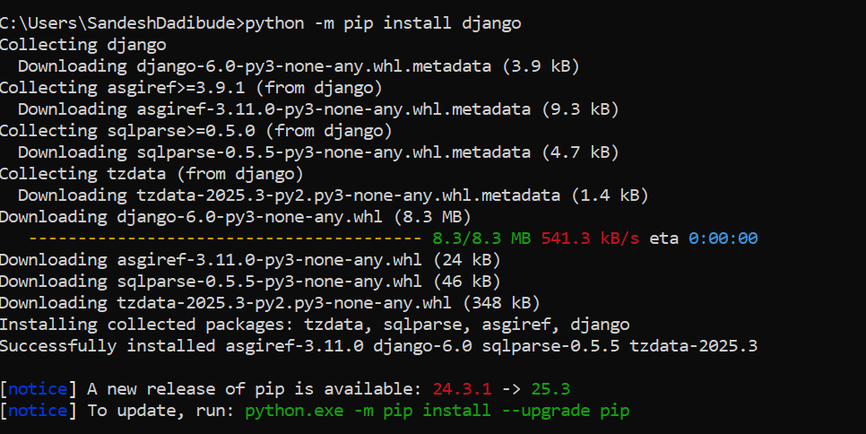
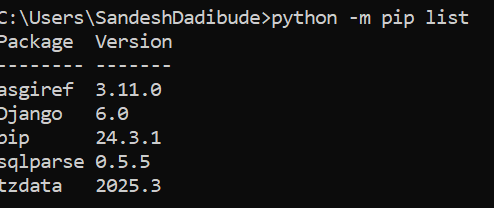
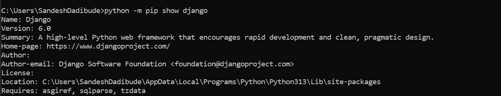
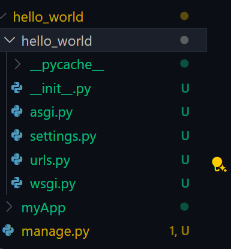
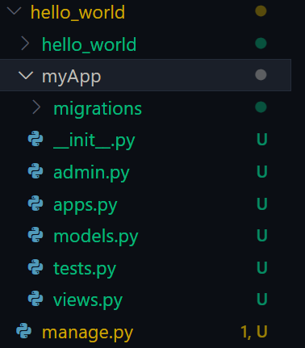
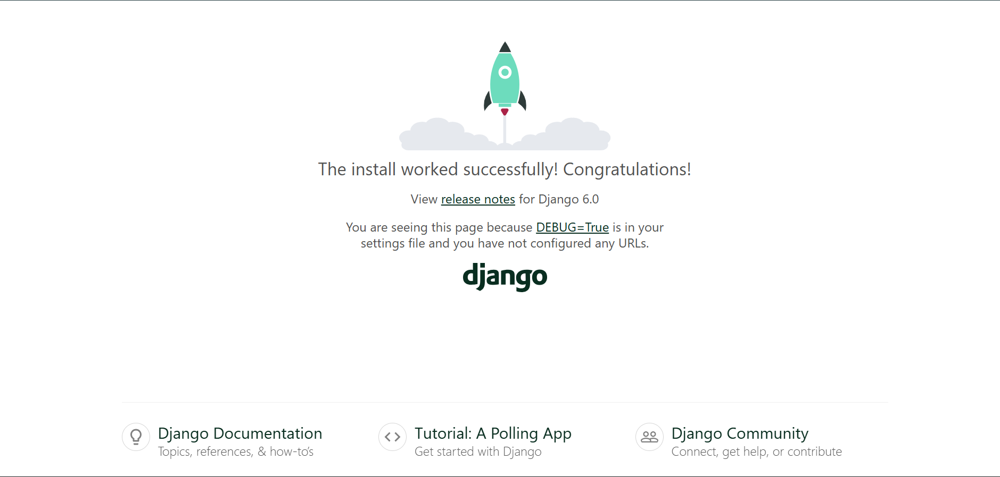
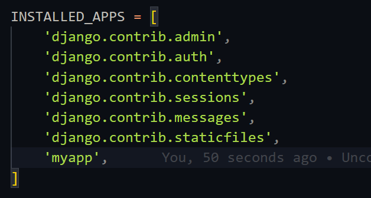

# Django-Workshop
Our college conducted a 10 hours Django workshop , So what we can learn that workshop they are have in this repo

# Django follows the MVT Architecture (Model View Template)
- Model: Handles DB's tables and data logic
- Views: Handles Business logic and process requests
- Template: Handle  frontend (Dyanmic HTML pages)

# Key Feature
- Build-in Admin Panel managing data easily.
- ORM(Object Relation Mapping) to communicate to the Tables 

# Basic Commands 
- pip : prefered install package (in my case : )
- pip install django : for install django 

- pip list : installed libraries

- python -m pip show django

- django-admin startproject hello_world (command to create django application/project)

## Folder Structure
- manage.py : heart of the django or application | Handle tasks
- wsgi.py (Web Server gatway Interface): All configuration

## Create App/Project
- python manage.py startapp myApp : Create project name myApp

## Run Application
- python manage.py runserver : Run the app

- python manage.py runserver 1008 : Change port

## Register App
- setting.py : we can use to register app into the setting.py file

# Templates in Django
- Templates its nothing but frontend disign part
- Includes HTML,CSS,Bootstrap
- Create index.html file into the templates/myApp